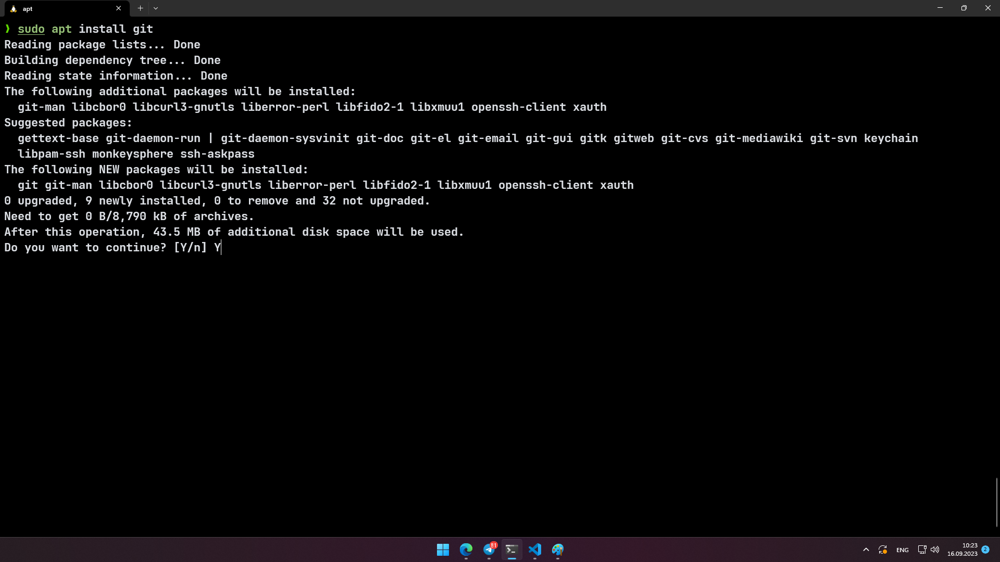
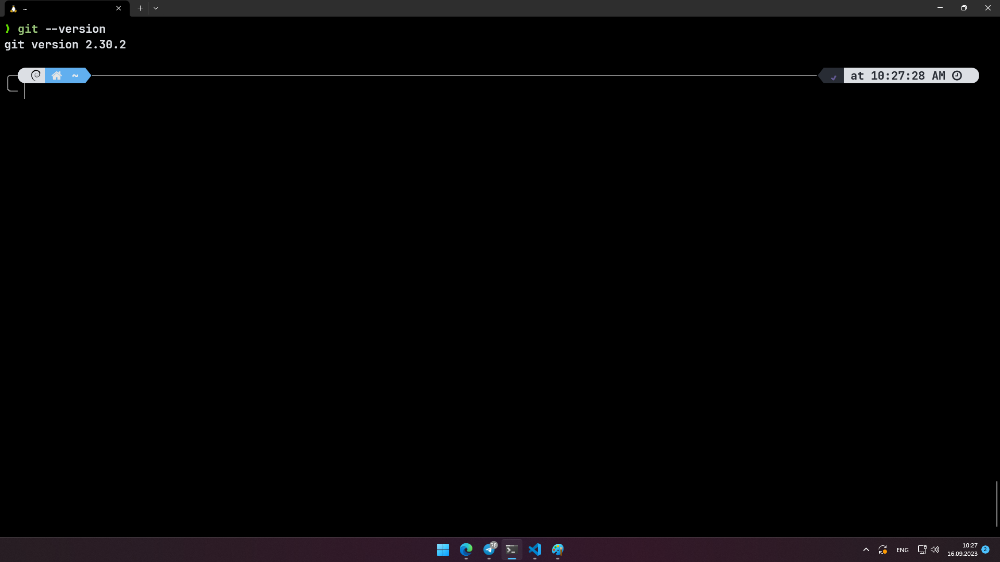
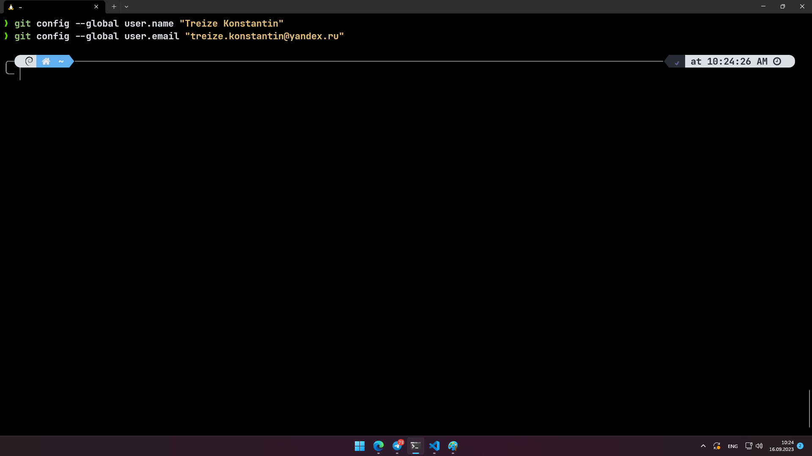

# Лабораторная работа №1 / Установка Git

Скриншоты:

1. Установка git с помощью `sudo apt install git`
   

  
2. Проверка установки с помощью `git --version`

   
3. Конфигурация пользователя с помощью `git config`

